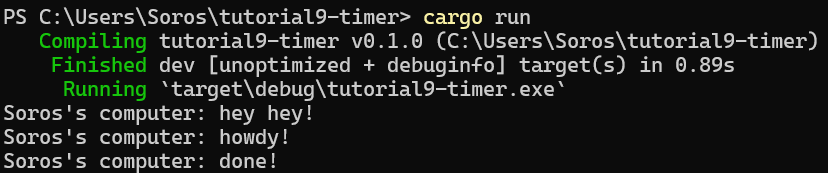
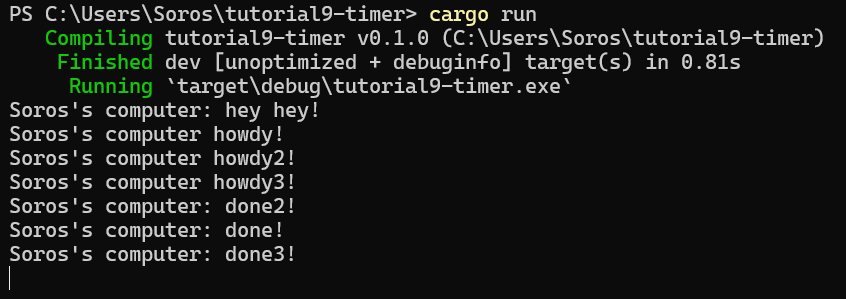

# Module 10: Asynchronous Programming
> **Soros Febriano** || **2206083445**

## Experiment 1.2: Understanding how it works.

The code runs the line `println!("Soros's computer: hey hey!");` first which is after the spawn spawner code block. This is because `executor.run()` line is placed below that print statement

## Experiment 1.3: Multiple Spawn and removing drop

The tasks are spawned simultaneously, but the completion of tasks are done asynchronously, resulting the `Soros's computer: done[number]!` messages printed not printed as order.

Other than that, the terminal is still running indefinitely because it is still waiting for tasks to be executed although it has been executed, this is caused because there is no `drop(spawner);`. 
